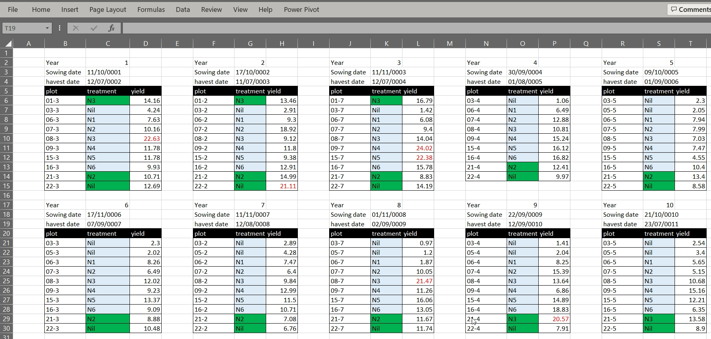
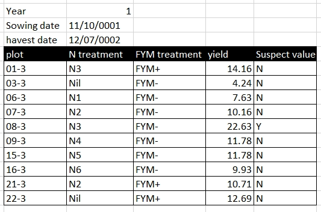

:::::::::::::::::::::::::::::::::::::: questions 

- What are the principles for using spreadsheets for good data organisation?

::::::::::::::::::::::::::::::::::::::::::::::::

::::::::::::::::::::::::::::::::::::: objectives

- Learn to recognise good and bad practice for managing tabular data in spreadsheet programs.
- Understand how good table structure helps to re-use data.

::::::::::::::::::::::::::::::::::::::::::::::::

## Introduction

Tables are a great way of presenting data, and spreadsheet software such as Google Sheets and Microsoft Excel are useful programs for making tabular datasets. Most researchers are familiar with Excel, it is easy to use, flexible, and includes tools for analysing and visualising data. Excel's flexibility gives us a lot of freedom to organise data, but this can lead to bad practices and data which are difficult to reuse. 

In the worst case Excel's default behavior may corrupt our data. For example consider a value like 1/12, or SEPT1. In both examples Excel will, by default, convert these values to dates, even if they are not intended by the user to be dates. In the example of SEPT1, this was a recognised name for a human gene which has since been renamed to SEPTIN1 specifically to avoid this type of data handling error when using Excel ([https://doi.org/10.1038/s41588-020-0669-3](https://doi.org/10.1038/s41588-020-0669-3)).  

::: challenge

## Bad tables in Excel

Using the data tables in the lesson Excel files, review them to identify any problems with that would make it difficult to reuse the data

:::::: hint

- What do you find confusing about the data?
- Do you have all the information you need to use the data? 
- Could you successfully combine the data?

::::::

:::::: solution

### Problems with the Broadbalk dataset
1. Plot names would be converted to dates in Excel
2. Treatments, FYM treatments are encoded using colour, and they key is not obvious
3. Yield does not provide units
4. Some yield values are coloured red, but not clear why

### Problems with the Sidada dataset
1. Multi-row column headings
2. Matrix style layout
3. Not even sure what the data is for
4. No metadata 

### Problems with the Chitedze dataset
1. Pretty layout – try saving as CSV, mix of data and metadata on one sheet
2. Headings span multiple columns
3. Use of undefined codes
4. Missing data flagged with -9999

### Problems with the Embu dataset
1. Inconsistent use of treatment names – first 3 years have a space between OM and N, OM and N rates are blank when not applied, but after are 0. Yield has missing values which are flagged * years 1-3 and N/A years 4-10
2. Yield combines units and value, should be separate
3. Yield has different units – bushels/acre and t/ha

### Can these datasets easily be combined and reused
- No, these datasets cannot easily be combined.

::::::
:::

## Common Spreadsheet Errors
There are several well known errors researchers make when using Excel. This section provides an overview of them.

### 1. Multiple tables in one spreadsheet

The Broadbalk example dataset has its data organised into separate tables for each year in one worksheet. While this view makes it visually easy for a human to view all the data on one screen, it makes it much harder for a computer to process the data. The computer does not recognise row 6 contains is for five different tears and column C includes both treatment codes, sowing and harvest dates for two differet years. If we wanted to calculate mean yields per treatment we would need to reorganise the data or manually reference cells in an Excel formula.     

{alt='Example of bad Excel practice using multiple tables in one Excel worksheet.'}

### 2. Using multiple tabs

Creating multiple tabs can improve data organisation by helping to separate different pieces of information. For example, in the Embu example dataset, the yield data is in a separate worksheet tab to the experiment information. However, with Excel, the computer will not be able to see connections which might exist between data in different tabs, for example, in the Embu example, the yield data is split into a separate worksheet per year, and while a human can see these data are related the computer cannot. Furthermore, key information, namely the year of the experiment is encoded in the worksheet name only. As with placing data in multiple tables in the same worksheet, placing data in multiple worksheets means you must either reorganise the data or write more data handling scripts before you can use the data.

Using multiple worksheet tab can introduce inconsistencies in the way tables are organised. It is always better to keep related together in one table. Keeping related data in one table may result in a large table, but Excel does provide tools to make it easier to navigate the data such as freezing column headings and column filters.  

If our spreadsheet has more than a few worksheet tabs, and you need to scroll through multiple tabs, it can become difficult and unwieldy to keep track of all the information.

### 3. Zeros, blanks and null values

A cell with a value 0 is different to a blank cell. To Excel, a blank cell means no data, whereas zero is data. Zero means you looked for something but did not observe it while blank is an absence of data. Excel and statistical programs may misrepresent blanks that should be zeros in subsequent analyses 

Very often we'll encounter datasets where missing data is encoded by a specific value, for example, -999, 999, NA, or *. Using values to encode missing data can cause problems. For example a statistical program will not recognise a numeric code for missing data from real numeric data, and a non-numeric character may cause the values to be treated as text rather than numbers. Therefore it is generally better to leave missing values as blank, but if they are encoded, the table metadata must document this, and the code must be used consistently. One key exception to this rule is if you plan to use the statistical software R, where the value NA can be used to indicate missing values.

Sometimes we might know why a value is missing, and this might be for one of several reasons. For example, in an LTE, missing data might be because the crop failed to establish, it was destroyed by animal pests, or it was destroyed by disease. Rather than encoding this information in the column recording yield, it is better to add a separate column recording the reason why data is missing.  

### 4. Using formatting to convey information

Formatting in Excel can include using different background colours for cells, using different colours for text, leaving blank rows or columns between data, or using border shading. For a human, formatting can be used to both make tables more readable and to convey information. Formatting to make a table more readable, for example, shading column headings, is acceptable, but using formatting to convey information must be avoided. Unlike a human, a computer cannot use formatting, and if the data is saved as a text format such as CSV or TAB, the information contained in the formatting is lost. 

Rather than using formatting to convey information, the information should be encoded as a new field. For example, in the Broadbalk dataset, green is used to identify treatments with FYM, and red text to indicate a suspicious value, these pieced of information should be added as separate columns:

{alt='Example of using formatting to convey additional information.'}

becomes

{alt='Example replacing formatting with additional columns to convey usable information.'}

### 5. Storing more than one piece of information in a cell

Using formatting to convey information is an example of storing more than one piece of information in a cell, you have both the cell value and the information encoded by the formatting. In the Sidada example, we can see treatment seems to encode information about several different treatments. This makes it difficult, for example, to select records based on a single factor level, for example if we wanted to identify plots with the N+ treatment rather than filtering on an exact term we must use a fuzzy search and select plots containing or like N+. Equally we cannot easily order rows on this value.

In the Embu dataset, yield data for some years combines both the yield value and yield units. This problematic for analysis as a computer would treat the value as text instead of as a number. The unit information should either be stored in a separate column, or as metadata for the yield value column description.  

### 6. Inconsistency in values used

Being inconsistent with value names can cause problems. For example, in the Embu data, `C. calothyrsus cuttings`, `Calliandra cuttings`, and `Calliandra cuttings` are used interchangeably and, as humans we can see these terms, in the context of the dataset, mean the same thing. A compuer, however, would treat these as different values.

### 7. Using problematic field names

Column names should be descriptive of the data they hold. A brief descriptive name should be preferred as it removes ambiguity and better conveys the meaning of the data. You can provide more detail about the column data in a separate metadata file. Abbreviations may make sense now, but will they make sense in 6 months time or to other researchers unfamiliar with your naming convention? Abbreviations are best used only when they widely accepted within a research community.

When naming columns be careful to avoid white spaces, starting with numbers, or special characters. white space, tabs and commas can all be interpreted as column delimiters, and some software packages won't accept column names with numbers. Underscores are a better alternative to white space. CamelCase (for example OrganicManureTreatment), can also be used, but may cause problems with software that treats column headings as case insensitive. 

Good Name | Avoid Name
--------- | -------------
yield_tha | yield (t ha-1)
organic_manure_type | OM type
treatment_label | treatment label
year_5 | 5th year

### 8. multi-row column names and merge cells

Using multi-row column headings can be useful mechanism for grouping related columns together in a hierarchical naming structure. For example, in the Sidada dataset column headings are across two rows, with cells merged to illustrate the grouped columns. while this works for a human a computer will not recognise this structure, and interpret the second row as data. Merged cells may also be unmerged to create nameless columns, for example, we can see this behavior if we export the Sidada data as CSV:

Compare between datasets
1.	Treatment factors and standard experiment management can be interchangeable between. For example, in application of N is a treatment for Broadbalk and Embu, but not in Chitedze.
2.	Collect similar information, for example soil properties but presented differently

::::::::::::::::::::::::::::::::::::: keypoints 

- Humans and computers can interpret data in Excel differently.
- sandBe aware of common problems using Excel for managing data.
- Excel is not a database.

::::::::::::::::::::::::::::::::::::::::::::::::

